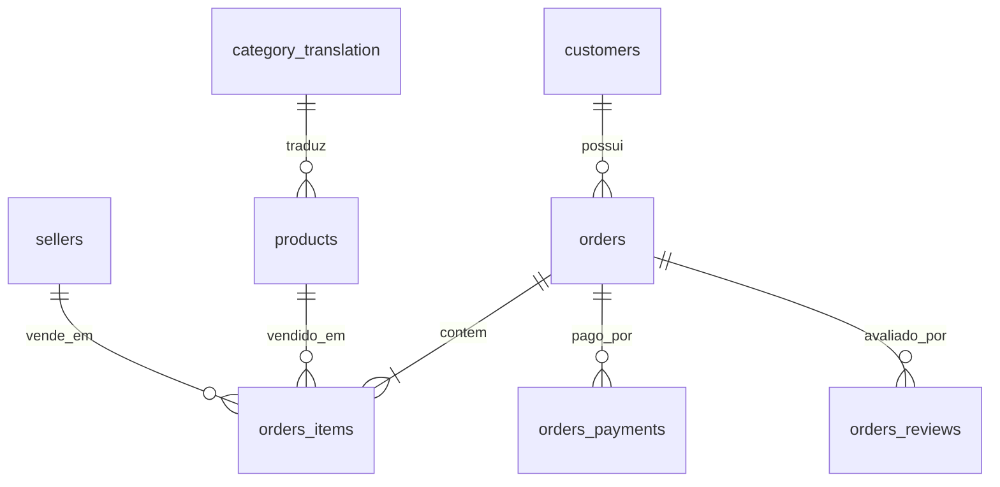

# Análise do E-commerce Olist com SQL

Análise exploratória do dataset brasileiro de e-commerce do **Olist** usando **PostgreSQL** e SQL puro — modelagem relacional, auditoria de qualidade de dados e KPIs de negócio.

**Base:** ~99 mil pedidos · 112 mil itens · 33 mil produtos · ~1 milhão de registros de geolocalização
**Período:** set/2016 – out/2018

## O que o projeto responde

**Qualidade dos dados** — [`sql/01_qualidade_dados.sql`](sql/01_qualidade_dados.sql)

- Quanto dado existe em cada tabela e em que janela temporal?
- O que está nulo onde não deveria?
- A mesma pessoa compra de vários endereços (`customer_id` vs. `customer_unique_id`)?
- A linha do tempo dos pedidos faz sentido (entrega antes da compra, status dessincronizado)?
- Onde estão os valores extremos (P50/P95/P99) e as anomalias de negócio?

**Desempenho** — [`sql/02_desempenho_pedidos.sql`](sql/02_desempenho_pedidos.sql)

- Quanto o negócio fatura e qual o ticket médio?
- Como as vendas evoluíram mês a mês?
- O prazo de entrega está sendo cumprido (estimado vs. real, por categoria)?
- Quais categorias, produtos e vendedores geram mais receita?

## Modelo de dados



Notas sobre o modelo:

- `geolocation` é tabela de referência (join por CEP, sem FK).
- `category_translation` **sem FK rígida**: 2 das 73 categorias não possuem tradução, e os KPIs usam `LEFT JOIN`.

## Como rodar

1. Crie o banco:

   ```bash
   psql -c "CREATE DATABASE olist;"
   ```

2. Crie o modelo (tabelas, índices e FKs):

   ```bash
   psql -d olist -f schema.sql
   ```

3. Carregue os CSVs **na ordem das dependências**. Usa-se `\copy`, que respeita aspas RFC 4180 — importante, pois a base contém campos multi-linha (mensagens de review):

   ```bash
   psql -d olist -c "\copy customers FROM 'olist_customers_dataset.csv' WITH (FORMAT csv, HEADER true)"
   psql -d olist -c "\copy products FROM 'olist_products_dataset.csv' WITH (FORMAT csv, HEADER true)"
   psql -d olist -c "\copy orders FROM 'olist_orders_dataset.csv' WITH (FORMAT csv, HEADER true)"
   psql -d olist -c "\copy sellers FROM 'olist_sellers_dataset.csv' WITH (FORMAT csv, HEADER true)"
   psql -d olist -c "\copy orders_items FROM 'olist_order_items_dataset.csv' WITH (FORMAT csv, HEADER true)"
   psql -d olist -c "\copy orders_payments FROM 'olist_order_payments_dataset.csv' WITH (FORMAT csv, HEADER true)"
   psql -d olist -c "\copy orders_reviews FROM 'olist_order_reviews_dataset.csv' WITH (FORMAT csv, HEADER true)"
   psql -d olist -c "\copy geolocation FROM 'olist_geolocation_dataset.csv' WITH (FORMAT csv, HEADER true)"
   psql -d olist -c "\copy category_translation FROM 'product_category_name_translation.csv' WITH (FORMAT csv, HEADER true)"
   ```

4. Rode as análises, na ordem: `sql/01_qualidade_dados.sql` → `sql/02_desempenho_pedidos.sql`.

## Decisões de modelagem (com justificativa)

| Decisão | Por quê |
|---|---|
| Pedidos `canceled`/`unavailable` excluídos das métricas de receita | ~1,2% do total; não representam venda realizada |
| PK composta `(order_id, payment_sequential)` em `orders_payments` | A base tem pedidos com múltiplas tentativas de pagamento (a maior sequência: 29) |
| `review_comment_message` como `TEXT` | Mensagens de até 208 caracteres, e 5.494 com quebras de linha embutidas |
| `seller_city` / `geolocation_city` como `VARCHAR(60)` | A coluna traz "cidade, estado, país" (máximo medido: 40 caracteres) |
| `category_translation` sem FK | 2 categorias sem tradução; uma FK rígida quebraria o load |
| `geolocation` sem PK | Um mesmo CEP pode ter mais de uma coordenada |

## Achados de qualidade de dados (medidos no dataset)

- **5.494** reviews com mensagem multi-linha (quebra de linha embutida no campo CSV)
- **29** tentativas de pagamento em um único pedido
- **2** das 73 categorias sem tradução: `pc_gamer` e `portateis_cozinha_e_preparadores_de_alimentos` (esta última com nome anômalo — parece categoria colada por engano)
- `customer_id` identifica *pessoa + endereço*; a pessoa é o `customer_unique_id` (relevante para qualquer análise futura de recorrência)

## Estrutura do repositório

```
├── schema.sql                     # modelagem: DROP, CREATE, índices, FKs
├── sql/
│   ├── 01_qualidade_dados.sql     # auditoria de qualidade
│   └── 02_desempenho_pedidos.sql  # KPIs de negócio
├── olist_*_dataset.csv            # dataset de origem (Kaggle)
├── product_category_name_translation.csv
├── LICENSE
└── README.md
```

## Dataset

Fonte: *Brazilian E-Commerce Public Data by Olist* ([Kaggle](https://www.kaggle.com/datasets/olist/brazilian-e-commerce-public-data)) — pedidos públicos do marketplace Olist, 2016–2018. Os CSVs estão versionados no repositório para que o projeto rode sem depender de download.

## Próximos passos

- KPIs de forma de pagamento e de avaliações (tabelas `orders_payments` e `orders_reviews` já modeladas)
- Categorias em português nos KPIs via `category_translation`
- Análise geográfica de vendas por estado (tabela `geolocation` já disponível)
